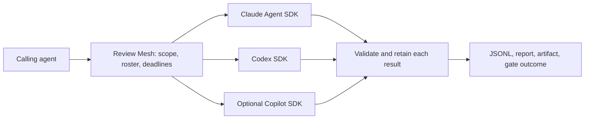

# SDK-owned review: architecture assessment and proposed design

**Date:** 2026-09-06
**Status:** Accepted routing: Codex SDK for OpenAI, Claude Agent SDK for Anthropic, Copilot SDK for other models. Implementation in progress with managed vendor runtimes.
**Audited baseline:** Review Mesh 9.7.0, commit `c6776e4bd63170612f933ac25de54323349381e8`.

## Verdict

The project has departed from its original execution architecture. The original [design](2026-08-29-review-mesh-design.md:10) explicitly excludes model inference, repository tool loops, provider transports, and provider-specific retries. Current Review Mesh implements those responsibilities in its OpenAI-compatible adapter and adds substantial review-conversation management around its native SDK adapters.

This does not require rebuilding the product. Claude Agent SDK, Codex SDK, and GitHub Copilot SDK integrations already exist. The useful core is configuration, review scope, reviewer scheduling, result validation, aggregation, progress, cancellation, and durable reports. Return execution of each review to the vendor harness.

Recommended target, subject to the process requirement below: **Claude Agent SDK first, Codex SDK as an independent second harness, Copilot SDK as an optional third harness or multi-model backend.** This ranking reflects the requested architecture and packaging fit; it is not a measured ranking of review quality.

## What the audit established

| Area | Current evidence | Assessment |
| --- | --- | --- |
| Original intent | Original design lines 10, 35, 101–120, 540 | Explicitly a thin coordinator over established coding-agent runtimes. |
| Production entry point | `src/app.ts:127` delegates to `src/app-v9.ts`; that calls `src/orchestrator/run-v9.ts` | Audit the v9 path, not only historical `run-review.ts`. |
| Raw inference | `src/adapters/openai-compatible.ts:1775`, `:2142`, `:3463` | Direct HTTP, `/chat/completions`, conversation history, tool dispatch, streaming, and finalization. This is a custom harness. |
| Context management | `src/adapters/context-budget.ts:35`; `segmented-review.ts:194`, `:303` | Own token estimates, budgets, evidence segmentation, checkpoint summaries, follow-up reads, and recovery. |
| Additional retries | `src/orchestrator/run-v9.ts:340`, `:702`, `:1544` | Provider circuits, repeated attempts, cooldown/backoff outside the native SDKs. |
| Claude integration | `src/adapters/claude.ts:307`, `:640` | Calls the real Agent SDK; the underlying agent loop is vendor-owned. |
| Copilot integration | `src/adapters/copilot.ts:774`, `:843` | Creates a real SDK session and sends a prompt. |
| Codex integration | `src/adapters/codex.ts:163`, `:204` | Real SDK integration exists, but production defaults to unavailable. |
| Extra conversations around SDKs | `src/orchestrator/run-v9.ts:1061`; `src/adapters/sdk-pages.ts` | All production adapters receive a model-facing page protocol. Claude/Copilot replace native read tools with custom snapshot tools and request page/schema/coverage repairs. |
| Deployment guidance | `README.md:786`–`:792` | Recommends the raw adapter for one-file deployment. Current Claude documentation provides a better packaging option. |

The raw adapter is over 4,000 lines, before its supporting segmentation, transport, tool, and budget modules. Line count is supporting context, not the reason for the verdict: ownership of the agent loop is the decisive issue.

There is no hardcoded provider default in the application. Configuration selects adapters. A restricted metadata inspection of the current global configuration found one registered adapter, `copilot_api_gateway`, with type `openai_compatible`; it is not a Copilot SDK registration. The source CLI's `describe . --json` returned `configuration.valid: false` for this checkout. A working effective roster here was therefore not established. No credentials, endpoint values, or instruction bodies were emitted.

## What “integrated into the binary” can mean

These requirements must be kept distinct:

1. **One distributed executable:** the user downloads one platform-specific Review Mesh executable, which can embed and extract vendor assets.
2. **No separate CLI installation and no terminal windows:** Review Mesh manages headless vendor runtimes with piped communication.
3. **No child processes at all:** agent execution, tools, Git/search helpers, hooks, and runtime services must remain inside the Review Mesh process.

The first two fit Claude's documented packaging model. The third is not met by Claude Agent SDK or the inspected Codex TypeScript SDK. Copilot has a promising experimental native transport, but its complete process behavior and compiled packaging have not been verified.

**Open requirement:** the user has been asked whether SDK-managed background processes are acceptable. No answer is assumed. A strict no-process answer requires the Copilot feasibility track before selecting an implementation architecture. “No model-invoked shell tools” is also stronger than “no visible shell windows” and must be tested separately.

## SDK comparison

| SDK | Harness and responsibilities | Runtime and packaging | Fit |
| --- | --- | --- | --- |
| `@anthropic-ai/claude-agent-sdk` | Claude Code agent loop, built-in repository tools, conversation state, automatic compaction, streaming, native retries, structured output | Bundled native CLI subprocess. Official Bun recipe embeds and extracts its platform binary. Published 0.3.251 launcher uses piped stdio and `windowsHide: true`. | Recommended first when managed subprocesses are acceptable. Native tools can be restricted to read/search. |
| `@openai/codex-sdk` | Codex threads, tool execution, native history compaction and provider retries, streamed events, JSON-schema result | Inspected TypeScript 0.151.0 wraps `codex exec` through `spawn` and JSONL. Native executable/assets require explicit packaging. | Independent second harness, after resolving current isolation and authentication limitations. |
| `@github/copilot-sdk` | Copilot agent loop, tool use, sessions, automatic compaction, models available to the account, optional BYOK | Default managed CLI process. v1.0.13 native FFI path constructs a Rust server in-process, but is experimental; native assets and tool/helper processes remain relevant. | Optional third harness; strongest candidate for a strict in-process feasibility study or one harness serving several models. |
| `@anthropic-ai/sdk` | API client with retry and tool-runner helpers | In-process client; application supplies tools and other application policy | Not equivalent to Claude Code's harness. Adopting this alone would retain responsibilities the user wants to remove. |

Sources: [Claude overview](https://code.claude.com/docs/en/agent-sdk/overview), [Claude subprocess model](https://code.claude.com/docs/en/agent-sdk/hosting#the-subprocess-model), [Claude single-executable recipe](https://code.claude.com/docs/en/agent-sdk/typescript#compile-to-a-single-executable), [Codex SDK](https://learn.chatgpt.com/docs/codex-sdk), [Copilot v1.0.13](https://github.com/github/copilot-sdk/releases/tag/v1.0.13), [Copilot FFI implementation](https://github.com/github/copilot-sdk/blob/v1.0.13/nodejs/src/ffiRuntimeHost.ts#L5-L15), [Anthropic client SDK](https://platform.claude.com/docs/en/cli-sdks-libraries/sdks/typescript).

### Claude details

Use **Agent SDK**, not just the Anthropic API client. `query()` supplies the vendor agent loop and `outputFormat` supplies structured results. Use actual `tools` selection plus permissions; `allowedTools` alone auto-approves tools and is not a restrictive tool allowlist. Prefer native `Read`, `Glob`, and `Grep`; disable write and shell tools when that is the approved review profile.

The SDK's compaction and normal retries replace our corresponding execution machinery. Authentication errors, exhausted credits, persistent provider errors, deadlines, and missing structured output still require terminal failure reporting. Do not enable indefinite retry-watchdog behavior by default for a bounded review job.

The current package already pins 0.3.251. Its platform assets and `extractFromBunfs` export exist. A single shipped executable still extracts a real native binary and starts a separate process. Validate Windows and Linux artifacts independently.

Use supported API/provider authentication. Do not assume an existing Claude subscription automatically licenses third-party application use of its login/rate limits. The overview describes Commercial Terms and approval requirements for that use. Supported gateway use requires Anthropic protocol compatibility; an arbitrary Chat Completions endpoint is not interchangeable.

Sources: [agent loop](https://code.claude.com/docs/en/agent-sdk/agent-loop), [structured results](https://code.claude.com/docs/en/agent-sdk/structured-outputs), [permissions](https://code.claude.com/docs/en/agent-sdk/permissions), [retry controls](https://code.claude.com/docs/en/env-vars), [gateway protocol](https://code.claude.com/docs/en/llm-gateway-protocol), [terms](https://code.claude.com/docs/en/agent-sdk/overview#license-and-terms).

### Codex details

Use one thread per reviewer, `runStreamed`, and the SDK's `outputSchema`. Native configuration already supports automatic compaction and HTTP/stream retry limits. Do not recreate that logic around it.

The current adapter is disabled by Review Mesh's own isolation contract. Its unit fixtures normally override that condition. The targeted installed-runtime characterization test passed during this audit: the pinned runtime still exposes project skill metadata despite suppression settings. This proves the existing reason for blocking; it does not prove runtime readiness or live review success.

Resolve that boundary through supported runtime configuration and a demonstrated read-only review environment. Do not simply set `isolationVerified = true`. Current code also requires an allowlisted `CODEX_API_KEY` and creates a fresh `CODEX_HOME`; it does not reuse the user's signed-in Codex account. Authentication behavior must be explicit and tested. Official docs support multiple local authentication modes and recommend API keys for general automation.

Codex's read-only sandbox does not mean process-free execution. Native repository inspection can use command tools. A blanket prohibition on all shell execution needs a separate compatibility assessment; do not promise full native Codex exploration with its required tools removed.

Sources: [configuration](https://learn.chatgpt.com/docs/config-file/config-reference), [authentication](https://learn.chatgpt.com/docs/auth), [sandbox controls](https://learn.chatgpt.com/docs/agent-approvals-security). Local process evidence: `node_modules/@openai/codex-sdk/README.md:5` and `dist/index.js:263`.

### Copilot details

Copilot can run multiple available model families while owning their execution. A Claude model in Copilot is **Copilot's harness running Claude**, not the Claude Agent SDK harness. Preserve the distinction between model diversity and harness diversity in configuration and reports.

Its infinite-session feature provides compaction. For structured review submission, ordinary sessions do not expose the same final JSON-schema API found in Claude/Codex in the inspected versions. A narrow `submit_review` custom tool with a schema, deterministic validation, and successful terminal behavior is appropriate. The vendor agent loop processes any validation error; Review Mesh must not add a parallel prompt-repair loop.

Published v1.0.13's FFI implementation states that it constructs the native Rust engine in the host process. However:

- The API is experimental, and some type comments still describe a spawned worker.
- Installed 1.0.11 has an older implementation; upgrading the version number alone does not establish behavior.
- Per-client environment, token, telemetry, and base-directory options have documented limitations in this mode; ambient environment is used. This is significant for concurrent identities and private runtime directories.
- Native helper tools, hooks, extensions, and stdio MCP servers can introduce subprocesses even with an in-process inference host.
- Import-only checks passed with the installed SDK under Node 24.20.0 and Bun 1.4.0. Native startup, teardown, process-tree behavior, and compiled executable packaging were not tested.

Therefore use the managed-process mode for an initial production path, or run the strict-process feasibility study before selecting FFI. Do not silently fall back to a child process when strict mode is requested.

Sources: [agent loop](https://github.com/github/copilot-sdk/blob/v1.0.13/docs/features/agent-loop.md), [in-process limitations](https://github.com/github/copilot-sdk/blob/v1.0.13/nodejs/src/types.ts#L183-L200), [context management](https://github.com/github/copilot-sdk/blob/v1.0.13/docs/features/context-management.md), [BYOK](https://github.com/github/copilot-sdk/blob/v1.0.13/docs/auth/byok.md), [runtime artifacts](https://github.com/github/copilot-sdk/blob/v1.0.13/nodejs/src/runtimeArtifacts.ts).

## Alternatives and selection

1. **Independent Claude + Codex adapters, optional Copilot — recommended if managed background runtimes are allowed.** Most closely restores the original neutral multi-harness architecture. Start with Claude to prove packaging and one complete review. Keep the other integrations thin and independently selectable.
2. **Copilot as the only harness.** Lowest adapter count and broad model routing through one SDK, including BYOK. Reasonable if the user prefers one vendor-maintained harness over independent harnesses. Its experimental FFI mode is the candidate for strict in-process operation; that deployment needs proof before adoption.
3. **API clients/tool runners only.** Can avoid a CLI host but still requires application-owned repository tools, context/session integration, and review execution policy. It does not meet the primary goal as closely and is not recommended as a packaging workaround.

Gemini integration is outside this proposal.

## Target ownership and flow

The SDK boxes own model requests, repository exploration, conversation state, compaction, and normal provider retries. Review Mesh calls each selected SDK directly; it does not ask one model to route prompts to another SDK.

| Keep in Review Mesh | Delegate to SDKs | Remove from live execution after migration |
| --- | --- | --- |
| Trusted config and explicit reviewer roster | Model calls and protocol transports | Raw OpenAI-compatible HTTP/SSE implementation |
| Review scope and deterministic source provenance | Repository exploration and tool loop | Host-managed evidence-turn/checkpoint scheduling |
| Bounded concurrency, wall-clock deadline, cancellation | Conversation state and compaction | Token estimation and context-window recovery framework |
| Native event translation and factual progress | Transient inference retry/backoff | Provider circuit/cooldown/retry engine |
| Result validation and complete per-reviewer delivery | Native structured output or terminal result tool | Model-facing digest/page/repair conversations |
| Artifact durability, recovery, status/report/dashboard | SDK session lifecycle internals | Custom model-output finalization retries |

Small custom tools are permissible when they serve a product boundary, such as submitting a result or reading an immutable input. They must not select model turns, manage model history, or turn Review Mesh back into the agent execution engine.

## Results, coverage, and “all reviews”

Every admitted reviewer must produce either its complete validated result or an explicit incomplete/cancelled outcome. Every configured reviewer must have a terminal disposition, including an explicit policy-driven skip when current quorum/adjudication rules require it. Preserve findings from completed reviewers when another fails. Never convert malformed output, exhausted budget, missing completion, or a timeout into a clean review.

Use native structured output once per reviewer initially. Preserve the full native final report as well as normalized findings. If outputs exceed the provider's limits, report incomplete with retained partial evidence; do not silently truncate and call it complete. If real workloads require incremental findings, add one SDK-invoked submission tool. Artifact chunking belongs after submission and must not require the model to calculate page digests or drive a custom protocol.

The existing 16 MiB result storage guard can remain as a delivery boundary. It is not a promise that an SDK can generate a 16 MiB answer in one turn.

Native tools inspect the live worktree in the initial simplified path. Report `live_worktree` consistency and initial/final provenance; if the workspace changes during review, report that observation and do not claim review of one immutable snapshot. A captured scope or Git digest cannot prove which bytes the agent inspected. Callers requiring an immutable review must supply a prepared immutable workspace; Review Mesh must reject unsupported snapshot guarantees rather than substitute live reads silently.

Native tool completion and model attestation do not prove that every file was read or understood. Version coverage metadata so it distinguishes:

- Declared review scope.
- File accesses observed through supported native telemetry, when available.
- Model-reported inspection.
- Unknown or incomplete coverage.

Do not label native telemetry as the current exact-byte coverage proof. A current configuration requiring that proof must receive an explicit migration choice or unsupported-capability error. No silent downgrade. Reliable execution and exhaustive bug detection are separate properties.

Keep current configured gate/quorum/adjudication behavior during the execution migration. Restoring the original policy of running all reviewers independently and returning all unmerged findings is a separate, explicit policy change. The recommended simplified product eventually uses that policy, but an adapter refactor must not silently alter the meaning of existing configurations or historical outcomes.

## Compatibility and rollout

- Keep CLI discovery, review, status, report, artifact recovery, and the read-only dashboard.
- Preserve historical artifact readers independently from old executable inference code.
- Add SDK execution behind a deliberate configuration migration; do not silently reinterpret a gateway model name as a vendor-native model.
- Route compatible existing custom endpoints through a supported SDK provider configuration, such as Copilot BYOK, only after validating that protocol and identity. Do not recreate translation/retry logic inside Review Mesh.
- Record harness, model, SDK/runtime version, execution mode, workspace consistency, and coverage basis separately. These are host-owned metadata, not claims accepted from model output.
- Fingerprint the execution contract for explicit retry inheritance: harness, model, runtime version, input/scope identity, workspace consistency, and coverage contract. Existing observed-snapshot evidence must not transfer into a native live-worktree result. When the fingerprint is incompatible or absent, rerun affected reviewers instead of inheriting incompatible completion or coverage proof.
- Propose retiring arbitrary command adapters to match the request to integrate the selected vendor SDKs. Command adapters already delegate execution; their removal is a separate product-surface choice, not required to eliminate custom inference. Keep that migration explicit rather than silently deleting existing registrations.
- Keep untracked `.agents/` and `docs/investigations/` content untouched.
- Do not change installed/global configuration, commit, push, or release as part of this assessment.

## Acceptance evidence required before switching execution

1. A real public CLI review using the chosen SDK reports a seeded defect and returns a clean corrected case.
2. The actual compiled Windows artifact works without a separately installed vendor CLI; repeat for the Linux release target.
3. Observed process behavior matches the selected contract; hidden child processes and zero child processes are separate acceptance cases.
4. Native tool restrictions preserve the workspace and explicitly report the achieved boundary.
5. Large-input review reaches native compaction without Review Mesh trimming history, creating checkpoints, or retrying model endpoints.
6. Native structured output or the submission tool reaches one valid terminal result; invalid/truncated output remains incomplete.
7. Cancellation, authentication failure, persistent rate limiting, process crash, and output-storage failure produce honest outcomes and leave completed findings accessible.
8. Existing result/report/dashboard/recovery and historical artifact compatibility remain intact.
9. No live SDK adapter imports the removed inference, context-budget, segmentation, or page-conversation modules.
10. Native integration tests execute through `review-mesh review`, not only a direct adapter call with legacy inputs.
11. A workspace mutation during review is reported without an immutable-snapshot claim; a retry cannot inherit completed results across incompatible harness/coverage/consistency contracts.

## Verification performed during this assessment

- Read original/current design, production routing, adapter code, config shape, packaging, and relevant tests.
- Read current official vendor documentation; inspected installed Codex and Copilot SDK code and release-pinned Copilot FFI source.
- Inspected only safe global configuration metadata; `describe` reported invalid effective configuration for this checkout.
- Ran `node node_modules/vitest/vitest.mjs run tests/adapters/codex.test.ts -t "characterizes the pinned runtime skill leak that keeps production unavailable"`: one passed, 25 skipped. It reproduces the known blocking behavior without inference.
- Copilot import-only checks under Node and Bun passed. They are not runtime or packaging validation.
- No paid inference, live review, dependency upgrade, runtime startup for the proposed architecture, production-code change, or release was performed.

The [implementation plan](../plans/2026-09-06-sdk-owned-review.md) defines the staged work after the process requirement and target design are accepted.

## Implementation status

The accepted routing is now implemented in `codex/sdk-owned-review`: OpenAI uses Codex SDK, Anthropic uses Claude Agent SDK, and other model IDs use Copilot SDK. Managed-process packaging was selected; experimental Copilot FFI is outside this implementation. The assessment above records the pre-refactor baseline.

Native execution uses the existing v4 findings/report shape with explicit `native_scope_attestation`, separate host-owned SDK/runtime metadata, and v6 JSONL/artifacts. Exact-byte coverage is not silently reused. Command-only legacy execution remains for compatibility; mixed command/native runs are rejected. Custom raw inference/segmentation/context-budget code has been removed. Read-only migration preview is available as `config migrate-sdk --json`.

Current validation covers local native SDK provider fixtures, public CLI/artifact paths, credentials/cancellation/cleanup, and Windows/Linux packaged runtime startup. Saved Windows user environment credentials were later loaded for isolated live synthetic SDK checks; see docs/sdk-validation.md for the measured outcomes. Native compaction remains unbenchmarked. The global configuration was not modified.
